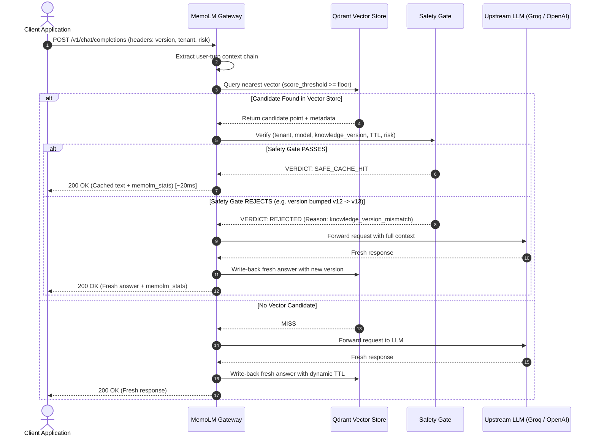

# 🧠 How MemoLM Works: Architecture, Mechanics & Design Guide

> **MemoLM** is an intelligent LLM Response Firewall and Safe Semantic Cache Gateway.  
> It acts as a high-speed reverse proxy between your application and LLM providers (Groq, OpenAI, Gemini), slashing latency by **up to 98%** and API costs to **$0.00** by reusing cached responses—**only when they are semantically relevant and verified 100% safe to reuse.**

---

## 📑 Table of Contents

1. [The Problem: Why Naive Semantic Caches Fail](#1-the-problem-why-naive-semantic-caches-fail)
2. [The MemoLM Philosophy: Response Firewall + Safe Semantic Cache](#2-the-memolm-philosophy-response-firewall--safe-semantic-cache)
3. [End-to-End Request Lifecycle](#3-end-to-end-request-lifecycle)
4. [Vector Embeddings & Context Chaining](#4-vector-embeddings--context-chaining)
5. [The Safety Gate: 6-Point Verification Matrix](#5-the-safety-gate-6-point-verification-matrix)
6. [Dynamic Semantic TTL](#6-dynamic-semantic-ttl)
7. [The SDK Layer: Architecture & Developer Experience](#7-the-sdk-layer-architecture--developer-experience)
8. [Resilience & Fail-Open Fallback Mechanics](#8-resilience--fail-open-fallback-mechanics)
9. [Telemetry, Explainability & Observability](#9-telemetry-explainability--observability)
10. [Comparison Matrix](#10-comparison-matrix)

---

## 1. The Problem: Why Naive Semantic Caches Fail

Most caching layers in the LLM ecosystem make a dangerous assumption:  
$$\text{High Cosine Similarity} \implies \text{Safe to Reuse}$$

In production applications, this assumption causes critical hallucinations, stale information, and security vulnerabilities:

### 🚨 Catastrophic Failure 1: Knowledge Drift (Stale Policies)
* **Day 1:** Company refund policy: *"Refunds are allowed within 30 days."*  
  *User asks:* *"What is your refund policy?"* ➔ LLM answers: *"30 days."* (Stored in cache).
* **Day 2:** Company updates refund policy to **14 days**.
* **Day 3:** Another user asks: *"How many days do I have to return an item?"*
* **Naive Cache:** Cosine similarity is `0.96` ➔ **Returns 30 days.**  
  **Result:** Hallucinated stale answer that violates company policy!

### 🚨 Catastrophic Failure 2: Multi-Tenant Data Leakage
* Tenant A (Financial Corp) asks: *"Summarize our fee structure for client X."*
* Tenant B asks: *"What is the fee structure for our accounts?"*
* **Naive Cache:** Queries are semantically similar ➔ **Leaks Tenant A's private data to Tenant B!**

### 🚨 Catastrophic Failure 3: Highly Volatile or Regulated Queries
* A user asks: *"What is the current stock price of TSLA?"* or a high-risk medical dosage question.
* Caching real-time or regulated answers leads to legal liabilities and incorrect information.

---

## 2. The MemoLM Philosophy: Response Firewall + Safe Semantic Cache

MemoLM sits transparently between your application and upstream LLMs. It combines **sub-millisecond vector similarity search** with a strict, policy-driven **Safety Gate**:

```
Application (OpenAI SDK / MemoLM SDK)
               │
               ▼  POST /v1/chat/completions
       ┌────────────────────────────────────────────────────────┐
       │                    MEMOLM GATEWAY                      │
       └────────────────────────────────────────────────────────┘
                               │
               ┌───────────────▼───────────────┐
               │    Semantic Search (Qdrant)   │
               │   Cosine Similarity Retrieval │
               └───────────────┬───────────────┘
                               │
                       [ Candidate Found ]
                               │
               ┌───────────────▼───────────────┐
               │        THE SAFETY GATE        │
               │  1. Tenant Boundary Match     │
               │  2. Model & Provider Match    │
               │  3. Knowledge Version Match   │
               │  4. TTL Expiration Check      │
               │  5. Risk Policy Threshold     │
               └───────────────┬───────────────┘
                               │
             ┌─────────────────┴─────────────────┐
             ▼                                   ▼
      [ ✅ ALL PASS ]                    [ ❌ ANY FAILS ]
      SAFE CACHE HIT                      SAFETY REJECTED / MISS
             │                                   │
      Return Cached Answer               Forward to Upstream LLM
      (~15ms - 25ms, $0 cost)            (Groq, OpenAI, Gemini)
                                                 │
                                         Save to Cache (if TTL > 0)
                                                 │
                                         Return Fresh Answer
```

---

## 3. End-to-End Request Lifecycle

When a request arrives at `POST /v1/chat/completions` (or `/openai/v1/chat/completions`):



---

## 4. Vector Embeddings & Context Chaining

A common mistake in multi-turn conversation caching is embedding the entire history—including assistant prose.

### The Assistant Prose Trap
In multi-turn chat, two users might have completely different intentions:
- User 1: *"Hello"* ➔ Assistant: *"Hello! How can I help you today? I can answer questions about billing, account settings..."* ➔ User 1: *"How do I change my password?"*
- User 2: *"Hi there"* ➔ Assistant: *"Hello! How can I help you today? I can answer questions about billing, account settings..."* ➔ User 2: *"What is the refund policy?"*

If both turns embed assistant prose, the massive shared prefix artificially inflates cosine similarity to `> 0.94`, returning the password change instructions for a refund query!

### MemoLM's Context Chain Solution
MemoLM filters conversation history down to **user turns only**:
1. Isolates `role == "user"` messages with non-empty text.
2. Derives:
   - `current_query`: The latest user turn (e.g. *"What is the refund process?"*).
   - `prior_messages`: Preceding user turns providing disambiguating context.
3. Stitches context with decaying weight so recent user turns dominate the vector space while preserving conversation direction.

---

## 5. The Safety Gate: 6-Point Verification Matrix

Every candidate retrieved from the vector index must pass all 6 checks in the Safety Gate:

| Check # | Check Name | Verification Rule | Action on Failure |
| :---: | :--- | :--- | :--- |
| **1** | **Tenant Isolation** | `cached.tenant_id == request.tenant_id` | ❌ Immediate Reject (prevents cross-tenant leaks) |
| **2** | **Model & Provider Match** | `cached.model == request.model` | ❌ Immediate Reject (prevents cross-model variance) |
| **3** | **Prompt Version** | `cached.prompt_version == request.prompt_version` | ❌ Immediate Reject (prompt template updates invalidate cache) |
| **4** | **Knowledge Version (Hero)** | `cached.knowledge_version == request.knowledge_version` | ❌ Immediate Reject (stale documentation invalidation) |
| **5** | **TTL Freshness** | `current_time < cached.created_at + ttl_seconds` | ❌ Immediate Reject (expired entry) |
| **6** | **Risk Policy Threshold** | `similarity >= risk_threshold(request.risk)` | ❌ Immediate Reject (high-risk queries require strict precision) |

### 🚀 Instant Invalidation Without Database Deletion
When your documentation, prices, or business policies change, you do **not** need to flush Redis or wipe Qdrant.  
Simply bump the `knowledge_version` from `"v12"` to `"v13"`.
All `"v12"` entries are instantly rejected by Check #4 and fresh answers under `"v13"` are automatically populated.

---

## 6. Dynamic Semantic TTL

Not all prompts should live in the cache for the same duration:
- **General Knowledge / FAQs** (e.g. *"What is your return window?"*): Safe for 7 to 30 days (`ttl = 604800s`).
- **Dynamic Data** (e.g. *"Current account balance"*): Should never be cached (`ttl = 0s`).
- **High-Risk Domains** (Medical, Legal, Credentials): Auto-classified to `ttl = 0s`, ensuring they always query fresh models.

MemoLM inspects incoming user queries and assigns dynamic TTL before writing back to the vector store.

---

## 7. The SDK Layer: Architecture & Developer Experience

The MemoLM SDKs ([Python](file:///C:/Users/anura/Desktop/memoLM/sdk/python) and [TypeScript](file:///C:/Users/anura/Desktop/memoLM/sdk/typescript)) provide two primary ways to integrate:

### Integration Mode A: Drop-in OpenAI Wrapper (`wrap_openai`)
For teams with an existing OpenAI codebase who don't want to rewrite their application:

```python
from openai import OpenAI
from memolm import wrap_openai

# Wrap your existing client — 1 line change!
client = wrap_openai(
    OpenAI(),
    gateway_url="http://localhost:8000",
    knowledge_version="v12",
    tenant_id="customer-corp",
    risk="low"
)

# Standard calls now pass through MemoLM automatically
response = client.chat.completions.create(
    model="gpt-4o",
    messages=[{"role": "user", "content": "How do refunds work?"}]
)
print(response.choices[0].message.content)
```

### Integration Mode B: Native Typed Client (`MemoLM` / `AsyncMemoLM`)
For full programmatic control with first-class arguments:

```python
from memolm import MemoLM

client = MemoLM(
    base_url="http://localhost:8000",
    default_knowledge_version="v12",
    default_tenant="customer-corp",
    max_retries=2,
)

response = client.chat.completions.create(
    model="openai/gpt-oss-20b",
    messages=[{"role": "user", "content": "How do refunds work?"}],
    knowledge_version="v12",
    risk="low",
    force_refresh=False,
)

# Access primary text & cache explainability
print(response.content)
if response.memolm_stats:
    print(f"Verdict: {response.memolm_stats.verdict}")
    print(f"Similarity: {response.memolm_stats.similarity}")
    print(f"Latency Saved: {response.memolm_stats.latency_saved}s")
```

---

## 8. Resilience & Fail-Open Fallback Mechanics

A caching gateway should **never take down your production application**. MemoLM features multi-layered resilience:

1. **Exponential Backoff with Full Jitter**:
   - Automatic retries on transient codes (`429`, `500`, `503`) and connection timeouts.
   - Uses `sleep = random(0, min(cap, base * 2^attempt))` to prevent thundering herds.
   - Respects upstream `Retry-After` headers.
2. **Fail-Open Fallback Mode (`fallback_to_upstream=True`)**:
   - If the MemoLM gateway is completely unreachable (e.g., during maintenance or network partition), the SDK catches the failure, emits a warning, and **transparently routes the query directly to the upstream LLM** (OpenAI, Groq).
   - Zero application downtime.

---

## 9. Telemetry, Explainability & Observability

MemoLM provides complete visibility into every cache decision:

```python
client = MemoLM(
    base_url="http://localhost:8000",
    on_cache_hit=lambda stats: print(f"⚡ Saved {stats.latency_saved}s (${stats.estimated_cost_usd})"),
    on_cache_miss=lambda stats: print("❌ Cache Miss -> LLM executed"),
    on_safety_reject=lambda stats: print(f"🛡️ Safety Blocked: {stats.rejection_reasons}"),
)
```

### Session ROI Tracker:
```python
metrics = client.get_session_metrics()
print(metrics)
# {
#   "total_requests": 142,
#   "cache_hits": 105,
#   "hit_rate_pct": 73.9,
#   "total_latency_saved_sec": 128.4,
#   "estimated_cost_saved_usd": 0.52
# }
```

---

## 10. Comparison Matrix

| Feature | Direct LLM (No Cache) | Naive Semantic Cache (GPTCache, RedisVL) | **MemoLM** |
| :--- | :---: | :---: | :---: |
| **Response Latency** | 1,200ms – 3,500ms | 20ms – 50ms | **15ms – 25ms** |
| **Token Cost** | 100% | 0% on match | **0% on safe match** |
| **Doc Version Invalidation** | N/A | ❌ Manual DB Wipe Required | **✅ Instant via `knowledge_version`** |
| **Multi-Tenant Protection** | Managed in code | ❌ Vulnerable to cross-tenant leak | **✅ Strict Tenant Boundary** |
| **Context-Aware Multi-turn** | ✅ Yes | ❌ Assistant Prose Saturation | **✅ User-turn Context Chaining** |
| **Fail-Open Resilience** | N/A | ❌ App crashes on cache down | **✅ Graceful LLM Fallback** |
| **Decision Explainability** | N/A | ❌ Opaque similarity float | **✅ 6-Point Audit Trace** |
