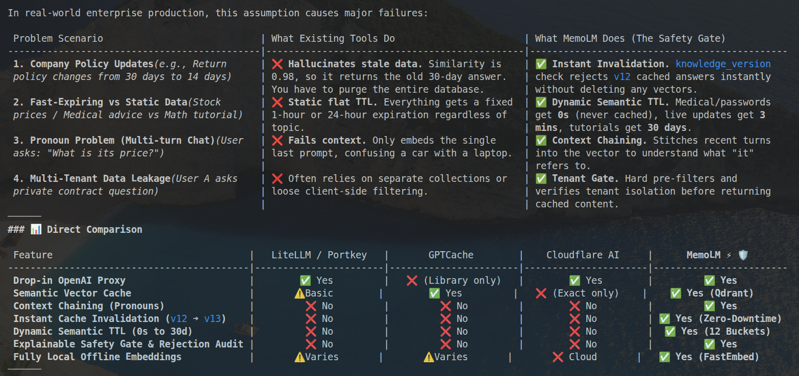

# 🧠 Core Concepts & Mental Model: Why MemoLM?

If you are a new developer joining MemoLM, read this document first.

---

## 🛑 The Problem: Semantic Similarity $\ne$ Safety to Reuse

When building LLM applications, cost and latency are major bottlenecks. Teams often introduce a **semantic cache**:
1. Take incoming user question $\rightarrow$ vectorize into embeddings.
2. If cosine similarity with an old question $> 0.90 \rightarrow$ return old answer.

### Why this fails catastrophically in production:

#### 🚨 Scenario 1: Documentation / Knowledge Updates
* **Yesterday:** Company return policy was 30 days.
* **Cached Answer:** *"Refunds are valid within 30 days."*
* **Today:** Policy changes to 14 days.
* **Customer asks:** *"Can I return my item?"*
* **Naive Semantic Cache:** `Cosine similarity = 0.96` ➔ **Returns 30 days (WRONG & STALE).**

#### 🚨 Scenario 2: Tenant Cross-Contamination
* Tenant A asks about their private contract.
* Tenant B asks a similar question.
* **Naive Semantic Cache:** Leaks Tenant A's private data to Tenant B.

#### 🚨 Scenario 3: Fast-Expiring Data
* User asks for real-time stock pricing or live inventory.
* An answer cached 1 hour ago is completely invalid.

---

## 🛡️ The MemoLM Solution: The Response Firewall

MemoLM introduces the **Safety Gate** between the semantic cache and the client:

$$\text{Cached Response} \xrightarrow{\text{Candidate Found}} \mathbf{\text{SAFETY GATE}} \xrightarrow{\text{Verified Safe}} \text{Client}$$

Before returning any cached answer, MemoLM rigorously verifies 5 conditions:

```
┌────────────────────────────────────────────────────────────────────────┐
│                        MEMOLM SAFETY GATE MATRIX                       │
├───────────────────────┬────────────────────────────────────────────────┤
│ Safety Check          │ Condition to Pass                              │
├───────────────────────┼────────────────────────────────────────────────┤
│ 1. Tenant Isolation   │ cached.tenant_id == request.tenant_id          │
│ 2. Model Matching     │ cached.model == request.model                  │
│ 3. Prompt Version     │ cached.prompt_version == request.prompt_version│
│ 4. Knowledge Version  │ cached.knowledge_version == request.knowledge  │
│ 5. TTL Validity       │ now < cached.created_at + ttl_seconds          │
│ 6. Risk Policy        │ similarity >= risk_threshold (or not high-risk)│
└───────────────────────┴────────────────────────────────────────────────┘
```

If **any condition fails**, MemoLM rejects the candidate, logs the exact rejection reason (e.g. `knowledge_version_mismatch`), and safely forwards the request to the upstream LLM.

---

## ⚡ The Economic & Latency Impact

| Metric | Without MemoLM | With MemoLM (Safe Hit) |
| :--- | :--- | :--- |
| **Response Latency** | `1,200 ms – 3,000 ms` | `15 ms – 25 ms` (98% faster) |
| **API Cost** | `$0.003 – $0.05 per request` | **$0.0000** |
| **Rate Limit Impact** | Consumes provider TPM/RPM quota | 0 quota consumed |
| **Answer Correctness** | Model-dependent | **Guaranteed against policy drift** |

## The competition

