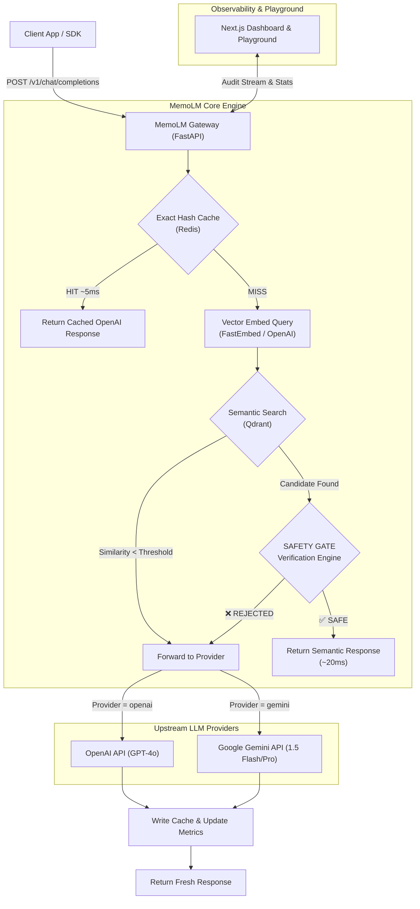

# 01. System Architecture & Technical Design

## 🏛️ High-Level System Architecture

MemoLM acts as a reverse proxy gateway placed in front of upstream LLM providers (e.g., OpenAI, Google Gemini).



---

## 🗄️ Storage & Cache Key Layout

To ensure absolute tenant isolation and prevent cross-contamination across models or system prompts, MemoLM structures its storage keys deterministically.

### 1. Redis Exact Match Key
```text
memolm:exact:{tenant_id}:{provider}:{model}:{prompt_version}:{knowledge_version}:{sha256(messages)}
```

* **Storage Type:** String (JSON payload)
* **Payload Content:**
```json
{
  "id": "chatcmpl-memolm-abc123",
  "object": "chat.completion",
  "created": 1740000000,
  "model": "gpt-4o",
  "choices": [
    {
      "index": 0,
      "message": {
        "role": "assistant",
        "content": "Refunds are available within 30 days of purchase."
      },
      "finish_reason": "stop"
    }
  ],
  "usage": {
    "prompt_tokens": 14,
    "completion_tokens": 12,
    "total_tokens": 26
  },
  "memolm_meta": {
    "cached_at": 1740000000,
    "knowledge_version": "v12",
    "risk_profile": "low",
    "ttl_seconds": 86400
  }
}
```

### 2. Qdrant Vector Collection
* **Collection Name:** `memolm_semantic_entries`
* **Vector Dimension:** 1536 (OpenAI `text-embedding-3-small` or 384 via `FastEmbed/bge-small-en-v1.5`)
* **Payload Metadata:**
```json
{
  "tenant_id": "org_default",
  "provider": "openai",
  "model": "gpt-4o",
  "prompt_version": "v1",
  "knowledge_version": "v12",
  "user_query": "What is the return policy?",
  "assistant_response": "Refunds are available within 30 days of purchase.",
  "response_payload": { ... },
  "created_at": 1740000000,
  "ttl_seconds": 86400,
  "risk_domain": "refund"
}
```
* **Payload Filtering Index:** `tenant_id`, `provider`, `model`, `prompt_version`.
