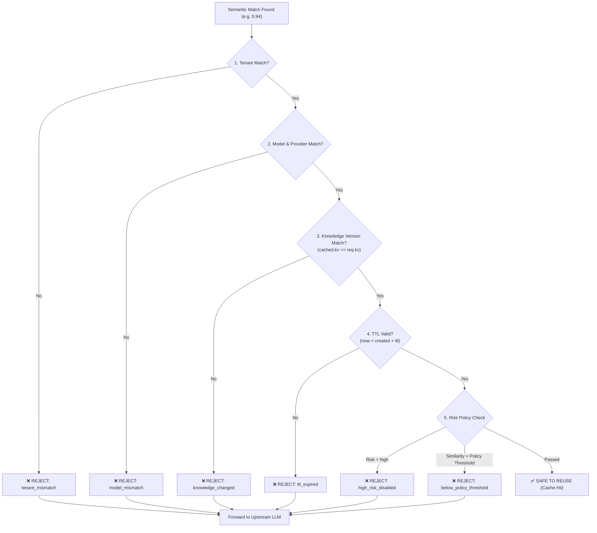

# 03. The Safety Gate Engine

## 🛡️ Why the Safety Gate is Essential

Traditional semantic caches use naive cosine similarity:
$$\text{similarity}(\vec{q}_{\text{new}}, \vec{q}_{\text{cached}}) \ge \tau \implies \text{RETURN CACHED RESPONSE}$$

This breaks down in production:
1. **Stale Knowledge:** Company changes refund policy from 30 days to 14 days. The semantic similarity is `0.98`, but the answer is **wrong and stale**.
2. **Expired Contexts:** Time-sensitive pricing or stock data cached 2 hours ago is returned when it had a 30-second validity window.
3. **High-Risk Domains:** Sensitive medical, legal, or financial queries must never be answered via speculative semantic cache.
4. **Tenant Leakage:** Responses generated for Tenant A must never be served to Tenant B.

---

## 🔍 Safety Verification Workflow

When a semantic candidate is found with cosine similarity $\ge$ baseline threshold (e.g., `0.90`), it enters the **Safety Gate**:



---

## 📊 Safety Gate Verdict Output Schema

```json
{
  "verdict": "SAFE" | "REJECTED",
  "similarity": 0.942,
  "threshold_applied": 0.90,
  "matched_query": "What is the return policy?",
  "checks": {
    "tenant_valid": true,
    "model_valid": true,
    "prompt_version_valid": true,
    "knowledge_version_valid": true,
    "ttl_valid": true,
    "risk_policy_allowed": true
  },
  "rejection_reasons": []
}
```
If rejected:
```json
{
  "verdict": "REJECTED",
  "similarity": 0.942,
  "threshold_applied": 0.90,
  "matched_query": "What is the return policy?",
  "checks": {
    "tenant_valid": true,
    "model_valid": true,
    "prompt_version_valid": true,
    "knowledge_version_valid": false,
    "ttl_valid": true,
    "risk_policy_allowed": true
  },
  "rejection_reasons": [
    "knowledge_version_mismatch: cached=v12, requested=v13"
  ]
}
```
