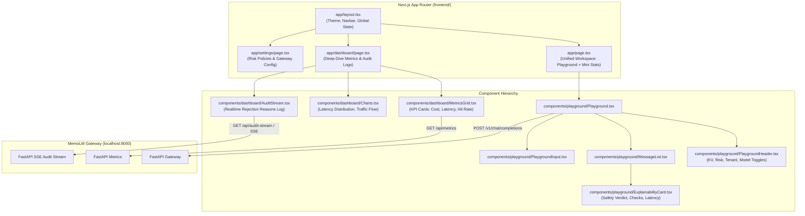

# 1. App & UI: Architecture & Implementation Plan 🖥️

**Module:** `1_app_and_ui`  
**Target:** Next.js 14+ (App Router), TypeScript, Tailwind CSS, Lucide Icons, Tremor / Recharts, Zustand / TanStack Query

---

## 🏛️ 1. High-Level Frontend Architecture

The MemoLM Frontend is a unified single-pane-of-glass application providing two primary surfaces:
1. **Interactive Demo Playground:** Where developers & hackathon judges test queries, toggle knowledge versions, switch providers, and inspect live safety gate explainability traces.
2. **Observability & Analytics Dashboard:** Real-time visibility into cost savings ($), latency reductions, cache hit ratios, and a live audit log of safety rejections.



---

## 📁 2. File & Directory Structure

```
frontend/
├── package.json
├── tsconfig.json
├── tailwind.config.ts
├── next.config.mjs
├── public/
│   ├── logo.svg
│   └── favicon.ico
├── src/
│   ├── app/
│   │   ├── layout.tsx                # Global layout with nav, status indicator
│   │   ├── page.tsx                  # Main playground + live stats ribbon
│   │   ├── dashboard/
│   │   │   └── page.tsx              # Full observability & analytics dashboard
│   │   └── settings/
│   │       └── page.tsx              # Tenant policies, thresholds & API keys
│   ├── components/
│   │   ├── common/
│   │   │   ├── Navbar.tsx            # Navigation bar with Gateway status badge
│   │   │   ├── Badge.tsx             # Hit/Miss/Rejected status badge
│   │   │   └── Modal.tsx             # Inspection modal for raw JSON
│   │   ├── playground/
│   │   │   ├── Playground.tsx        # Main container with chat & side inspect
│   │   │   ├── PlaygroundHeader.tsx  # Controls: KV (v12/v13), Risk, Provider
│   │   │   ├── MessageList.tsx       # Message thread with markdown rendering
│   │   │   ├── MessageItem.tsx       # Individual bubble (User / Assistant)
│   │   │   ├── ExplainabilityCard.tsx# THE STAR: Detailed decision badge & drawer
│   │   │   └── PlaygroundInput.tsx   # Textarea + sample query chips
│   │   └── dashboard/
│   │       ├── MetricsGrid.tsx       # 4 KPI Stat Cards
│   │       ├── LatencyComparison.tsx # LLM vs Exact vs Semantic bar chart
│   │       ├── RejectionPieChart.tsx # Breakdown of why cache hits failed
│   │       ├── AuditStream.tsx       # Real-time event table
│   │       └── CostSavingsCard.tsx   # ROI calculator & live cost saved counter
│   ├── lib/
│   │   ├── api.ts                    # Gateway client (POST completions, GET stats)
│   │   ├── types.ts                  # Complete TypeScript definitions
│   │   └── store.ts                  # Zustand state store (for playground state)
│   └── styles/
│       └── globals.css
```

---

## 🎨 3. UI Theme & Design System

* **Design Philosophy:** Modern, developer-centric, high-contrast dark mode (like Vercel / Linear / Raycast).
* **Color Palette:**
  * Background: Slate/Zinc 950 (`#09090b`)
  * Cards/Surfaces: Zinc 900 (`#18181b`) with border Zinc 800 (`#27272a`)
  * 🟡 **LLM Call:** Amber 500 (`#f59e0b`) — indicates an expensive, full LLM execution.
  * 🟢 **Safe Cache Hit:** Emerald 500 (`#10b981`) — indicates instant, safe semantic reuse.
  * 🔴 **Safety Gate Rejected:** Rose 500 (`#f43f5e`) — indicates a candidate was detected but safely blocked.
  * 🔵 **Exact Hash Hit:** Cyan 500 (`#06b6d4`) — indicates ~5ms instant hash hit.
* **Typography:** `Inter` or `Geist Sans` for UI, `Geist Mono` / `JetBrains Mono` for JSON traces and latency numbers.

---

## 🔄 4. State Management Strategy

Using **Zustand** (`src/lib/store.ts`) for clean, decoupled UI state:

```typescript
interface PlaygroundState {
  // Session Configuration
  tenantId: string;
  knowledgeVersion: string; // e.g. "v12"
  riskLevel: "low" | "medium" | "high";
  provider: "openai" | "gemini";
  model: string;
  
  // Chat History
  messages: Array<{
    id: string;
    role: "user" | "assistant" | "system";
    content: string;
    meta?: MemoLMMetadata;
  }>;
  
  // Actions
  setKnowledgeVersion: (v: string) => void;
  setRiskLevel: (r: "low" | "medium" | "high") => void;
  setProvider: (p: "openai" | "gemini") => void;
  sendMessage: (query: string) => Promise<void>;
  clearChat: () => void;
}
```

---

## ⚡ 5. Implementation Milestones for the Frontend Dev

1. **Milestone 1: Scaffold & Theme Setup (Hours 1–2)**
   * Create Next.js 14 project with Tailwind & Lucide.
   * Configure layout, Navbar with live Gateway connection status.
2. **Milestone 2: Playground & Explainability Card (Hours 3–6)**
   * Implement `PlaygroundHeader` with Knowledge Version bump buttons.
   * Build `ExplainabilityCard` rendering all 5 safety check results.
   * Integrate sample quick-prompt chips (*"What is the refund policy?"*, *"Can I get money back?"*).
3. **Milestone 3: Observability Dashboard & Charts (Hours 7–9)**
   * Build KPI cards (Cost Saved, Latency Saved, Hit Rate).
   * Render Recharts/Tremor visual breakdown for Latency & Rejections.
   * Implement auto-polling or SSE event feed for the live Audit Stream.
4. **Milestone 4: Polish & Hackathon Demo Mode (Hours 10–12)**
   * Add a "Run Demo Script" interactive walkthrough banner for judges.
   * Ensure mobile/desktop responsiveness and zero layout shift.
