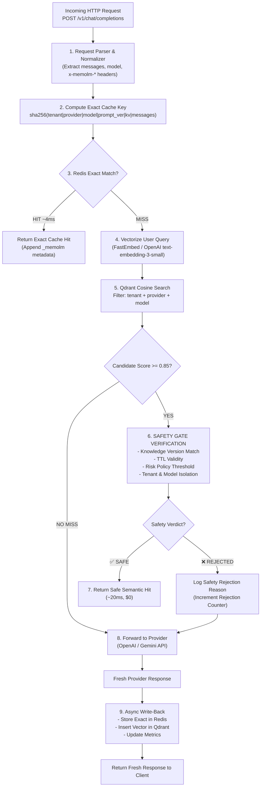

# 2. Core Engine: Architecture & Pipeline Plan ⚙️🛡️

**Module:** `2_core_engine`  
**Target:** Python 3.11+, FastAPI, Redis (aioredis), Qdrant (or FastEmbed vectors), Pydantic v2, HTTPX

---

## 🏛️ 1. High-Level Engine Pipeline

The MemoLM Core Engine is an asynchronous, high-throughput gateway that intercepts every request at `POST /v1/chat/completions`.



---

## 📁 2. Backend File & Directory Structure

```
backend/
├── pyproject.toml
├── Dockerfile
├── docker-compose.yml
├── .env.example
├── app/
│   ├── __init__.py
│   ├── main.py                   # FastAPI app, lifespan setup, CORS, router
│   ├── config.py                 # Pydantic Settings (REDIS_URL, QDRANT_URL, API keys)
│   ├── models/
│   │   ├── __init__.py
│   │   ├── openai_schema.py      # Strict OpenAI request/response Pydantic models
│   │   └── memolm_schema.py      # _memolm explainability & safety schemas
│   ├── core/
│   │   ├── __init__.py
│   │   ├── normalizer.py         # Extracts user query, builds deterministic cache keys
│   │   ├── exact_cache.py        # Redis exact match engine (GET/SET with TTL)
│   │   ├── vector_search.py      # Qdrant client + FastEmbed / embedding pipeline
│   │   ├── safety_gate.py        # THE CORE: 5-step Safety verification rules
│   │   └── metrics_tracker.py    # Redis atomic counters (latency, cost, hit rate)
│   ├── providers/
│   │   ├── __init__.py
│   │   ├── base.py               # Abstract provider adapter interface
│   │   ├── openai_adapter.py     # OpenAI API client wrapper
│   │   └── gemini_adapter.py     # Google Gemini API client wrapper
│   └── api/
│       ├── __init__.py
│       ├── v1/
│       │   └── completions.py    # POST /v1/chat/completions endpoint
│       └── internal/
│           ├── metrics.py        # GET /api/metrics endpoint
│           └── audit.py          # GET /api/audit-stream (SSE event stream)
└── tests/
    ├── test_exact_cache.py
    ├── test_safety_gate.py
    ├── test_gateway.py
    └── test_providers.py
```

---

## 🔐 3. Storage & Database Design

### A. Redis Key Space (`exact_cache.py` & `metrics_tracker.py`)

1. **Exact Cache Keys:**
   ```text
   memolm:exact:{tenant}:{provider}:{model}:{prompt_ver}:{knowledge_ver}:{sha256(messages_json)}
   ```
   * **Value:** JSON string of full completion response + `_memolm` block.
   * **TTL:** Configurable per entry (default 86400s).

2. **Real-time Global Metrics Counters:**
   * `memolm:metrics:total_requests` (Integer)
   * `memolm:metrics:exact_hits` (Integer)
   * `memolm:metrics:semantic_hits` (Integer)
   * `memolm:metrics:llm_calls` (Integer)
   * `memolm:metrics:tokens_avoided_prompt` (Integer)
   * `memolm:metrics:tokens_avoided_completion` (Integer)
   * `memolm:metrics:rejections:{reason}` (Hash / Integers: `knowledge_changed`, `ttl_expired`, `risk_policy`, `tenant_mismatch`)

### B. Qdrant Vector Collection (`vector_search.py`)
* **Collection Name:** `memolm_semantic_entries`
* **Vector Distance:** `Cosine`
* **Payload Fields:**
  * `entry_id` (UUID)
  * `tenant_id` (Keyword index)
  * `provider` (Keyword index)
  * `model` (Keyword index)
  * `prompt_version` (Keyword index)
  * `knowledge_version` (Keyword index)
  * `user_query` (Text)
  * `response_payload` (JSON)
  * `created_at` (Integer timestamp)
  * `ttl_seconds` (Integer)
  * `risk_domain` (Keyword index)

---

## ⚡ 4. Implementation Milestones for Backend Dev

1. **Milestone 1: Gateway Ingress & OpenAI Schema (Hours 1–3)**
   * Setup FastAPI project with strict Pydantic v2 schemas for `POST /v1/chat/completions`.
   * Implement custom header parsing (`x-memolm-*`).
2. **Milestone 2: Exact Cache & Provider Adapters (Hours 4–6)**
   * Redis async client integration (`exact_cache.py`).
   * OpenAI & Gemini adapter stubs with normalized response shaping.
3. **Milestone 3: Vector Search & The Safety Gate (Hours 7–10)**
   * Qdrant collection setup + fast embedding integration.
   * Implement the complete `SafetyGate` decision engine with knowledge-version checking.
4. **Milestone 4: Metrics, Audit Stream & Testing (Hours 11–12)**
   * Add `/api/metrics` and SSE `/api/audit-stream` endpoints for the frontend.
   * End-to-end integration tests proving cold miss ➔ semantic hit ➔ KV rejection.
